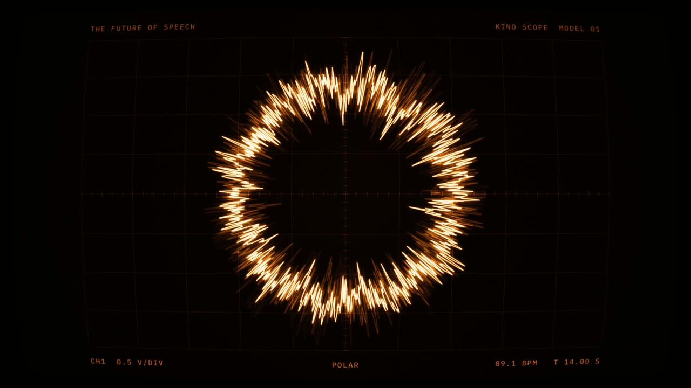

# kino

Kino is a modular motion-design toolkit for [HyperFrames](https://github.com/heygen-com/hyperframes). It collects reusable drawing primitives, procedural animation, rendering passes, and visual styles for making code-driven video. Instead of building every composition from scratch, you can combine different sources, ways of moving through a scene, and materials that determine how the finished image looks.

The core idea is separation: a source draws the image, an arrangement controls its movement, and a pass gives it a material character, from cyanotype and risograph to phosphor and ordered dithering. These parts are designed to mix. Kino also has audio-analysis signals for making visuals respond to beats, energy, and waveforms, but the toolkit isn't limited to music-driven work.

<table>
  <tr>
    <td></td>
    <td></td>
  </tr>
  <tr>
    <td></td>
    <td></td>
  </tr>
</table>

These stills show four visual languages built with the same toolkit: blueprint, cyanotype, phosphor, and riso. The examples use audio-reactive compositions, but the underlying sources, arrangements, and passes can be reused independently. See `examples/styles/index.html` for more.

## How it works

Every frame goes through the same pipeline. Sources paint a grayscale picture, arrangements move it in time, and a pass turns the grayscale into a medium: ink on paper, phosphor, a two-colour riso print, an ordered dither. When a piece follows music, signals read the song first (beats, bars, drum hits, spectrum, bass) and drive the rest.

Because sources paint grayscale and the pass decides what that becomes, most sources work under most passes, and a look is a pass setting plus a palette and some motion rules. blueprint's pen drawings, for example, run under the cyanotype material with no library changes. The passes don't all read their input the same way, though: `risoPass` takes two separations, one per ink, and `screenPass` has a colour mode. `docs/architecture.md` has the table.

Everything is a pure function of time. HyperFrames seeks frames in any order, so nothing is allowed to remember the previous frame, and anything time-driven paints through `timeDriver` instead of GSAP callbacks (which don't fire during a render).

`docs/architecture.md` goes through every piece. `docs/lessons.md` is what broke along the way and why the defaults are what they are.

## Layout

```
src/            the library, bundled to window.Kino
  signals/      beatMap, bandEnergy, bassFollower, ...
  sources/      pen, beam, sunprint, spectrumFeed, htmlPlate, painters
  arrange/      sheetCamera, printRun, registerDrift, tornWipe, lensPass
  passes/       screenPass (WebGL), risoPass, ditherPass
  looks/        cyanotype, blueprint, phosphor, riso, ...
scripts/        build, plus Python for spectrum, raw samples and dithering footage
compositions/   each one a standalone HyperFrames project
research/       teardowns of other people's videos, and experiments
tools/dither/   a playground for the dither settings
```

## Running it

You need Node, the `hyperframes` CLI with a headless Chrome that has WebGL2, and Python with librosa and numpy for the audio scripts.

```sh
npm install
npm test             # unit tests for the clock, signals and arrangements
npm run build        # bundles src/ into every composition's vendor/
scripts/smoke.sh     # end to end on a synthetic composition, no music needed
```

Then `cd compositions/<name>` and use `hyperframes snapshot` or `hyperframes render`. On Linux under Wayland, unset `WAYLAND_DISPLAY` for anything that uses `screenPass`, or headless Chrome comes up without WebGL and the canvas renders black. `scripts/smoke.sh` also wants ImageMagick.

The music and its analysis aren't in the repo, so most compositions won't render as they are. Run `scripts/spectrum.py` and `scripts/samples.py` on your own track to make the data they expect. `smoke` is the one that runs from a clean clone.

## Status

A personal, evolving library rather than a published package: there's nothing on npm, and it changes as the pieces built with it need. The canvas looks are where the work is. The `dom/` pieces (GSAP on HTML elements) are from the first round and still work, but nothing new uses them.

## License

MIT, see [LICENSE](LICENSE).
